### Objectives

- QGIS interface;
- vector symbology;
- raster symbology;
- map layout.

### Key steps

- Create a new user profile;
- Create a new project;
- Add vector data;
- Symbolize data;
  - Single symbols;
  - Categorized symbols;
- Enable labels;
- Change map projection;
- Create map layout;
  - Add map;
  - Fix layers for map;
  - Add legend;
  - Add scalebar;
  - Add author info;
- Return to main QGIS window;
  - Toggle off layers;
- Add raster data;
- Symbolize raster data;
- Create a copy of layout;
- Export layouts to external formats.

### Screenshots and additional explanations

#### Creating a new user profile

User profiles allow for quick switching between settings. Create a new profile and switch its language to English. Your default profile will keep your original language.

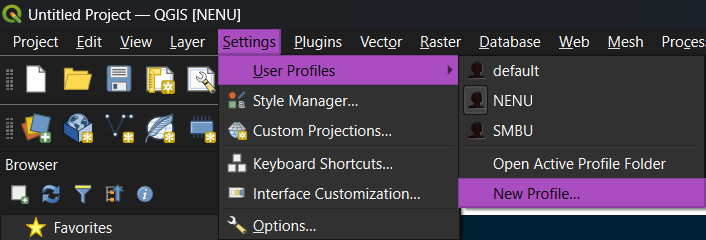

#### QGIS interface

Four main elements:

1. Map frame (now empty)
2. Toolbars (upper part)
3. Browser panel (left side, up)
4. Layers panel (left side, down)

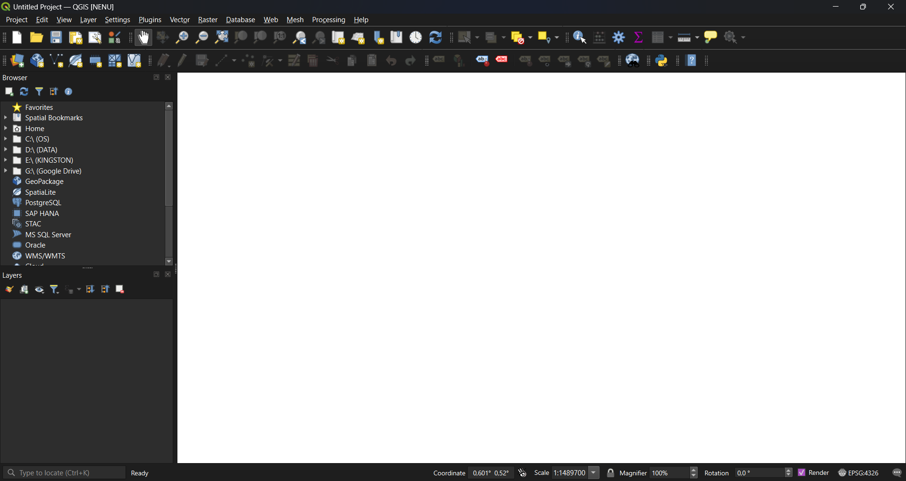

#### Creating a project

Press "Project" – "New" or `Ctrl+N`. Save project to the location where your data are stored.

#### Add layers to project

Layers may be added by:

1. Drag&drop from Browser panel.
2. Drag&drop from Windows Explorer / Finder.
3. Via Data source manager toolbar.

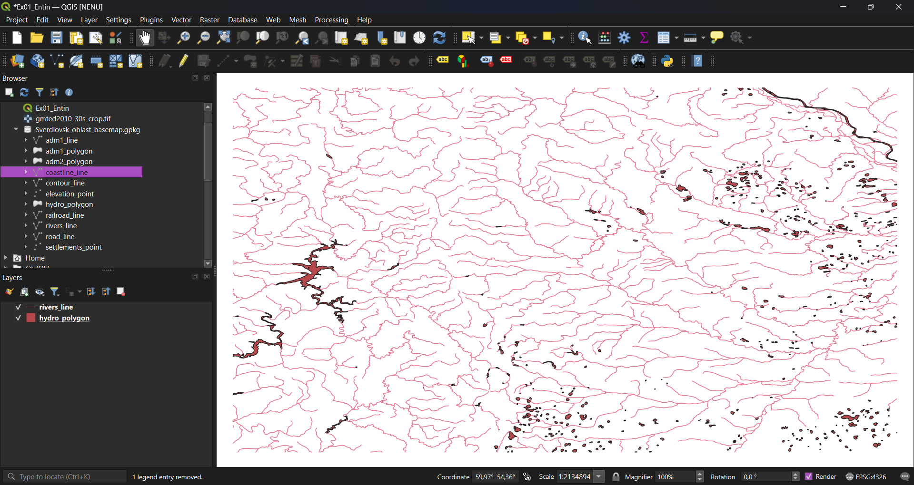

#### Manage vector layer symbology

Symbology is set to a layer. To access symbology settings, double click a layer in a "Layers" panel (or press right mouse button and select "Properties"), then find and click "Symbology" on the left side of the Properties window.

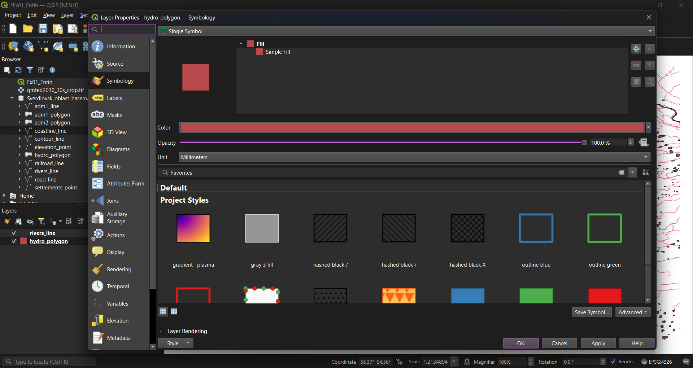

You can choose one of the default symbols or create your own by customizing fill, outline and other properties.

The layer symbol could itself consist of multiple layers. To add a symbol layer, press "+" button at the upper-left corner.

By default, all features in the layer are painted in a same symbols. You can also change symbol behaviour to "Categorized", "Graduated", and other variants.

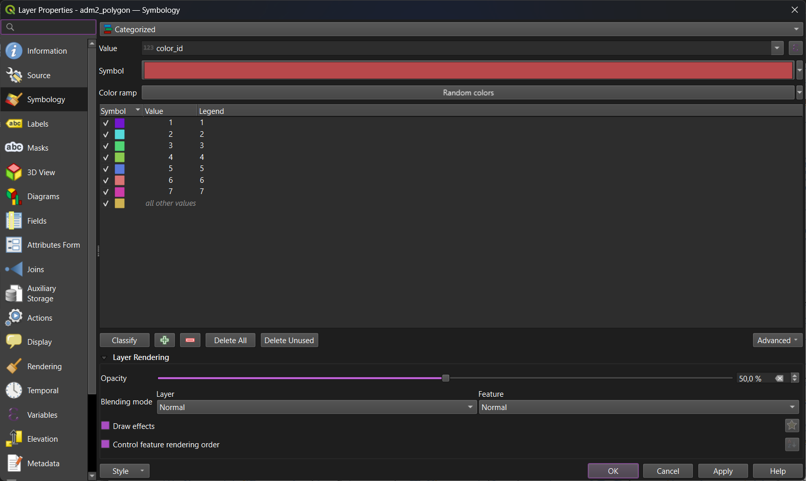

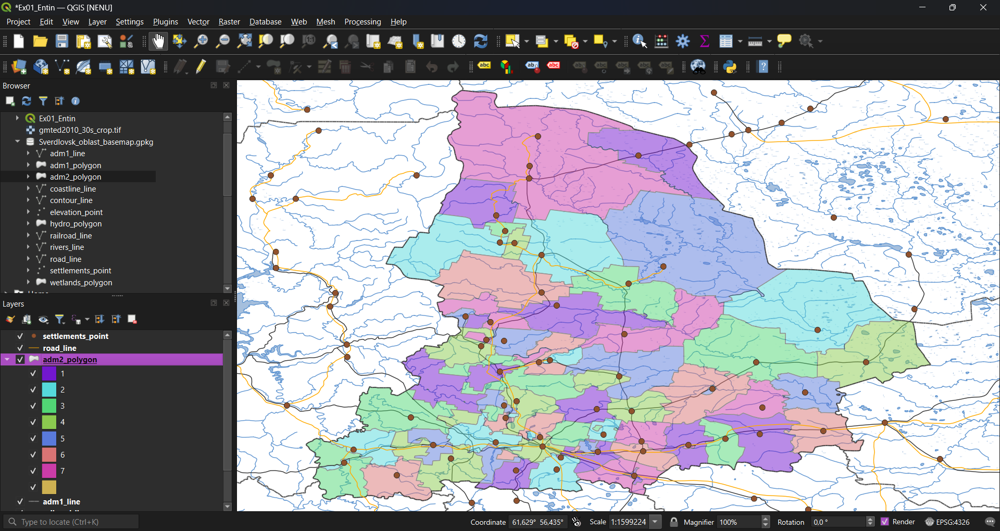

#### Manage labels

Labels are usually generated from feature attributes. To access labels settings, double click a layer in a "Layers" panel (or press right mouse button and select "Properties"), then find and click "Labels" on the left side of the Properties window. Change default setting ("No labels") to "Single labels" to enable label generation

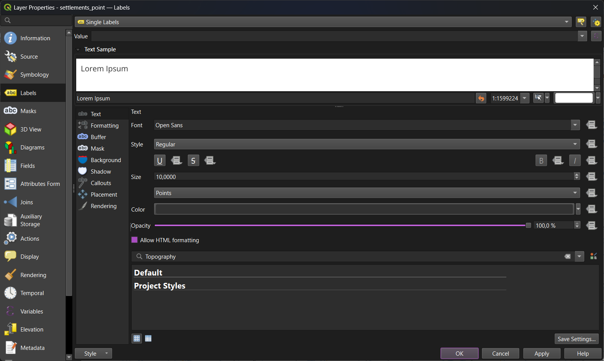

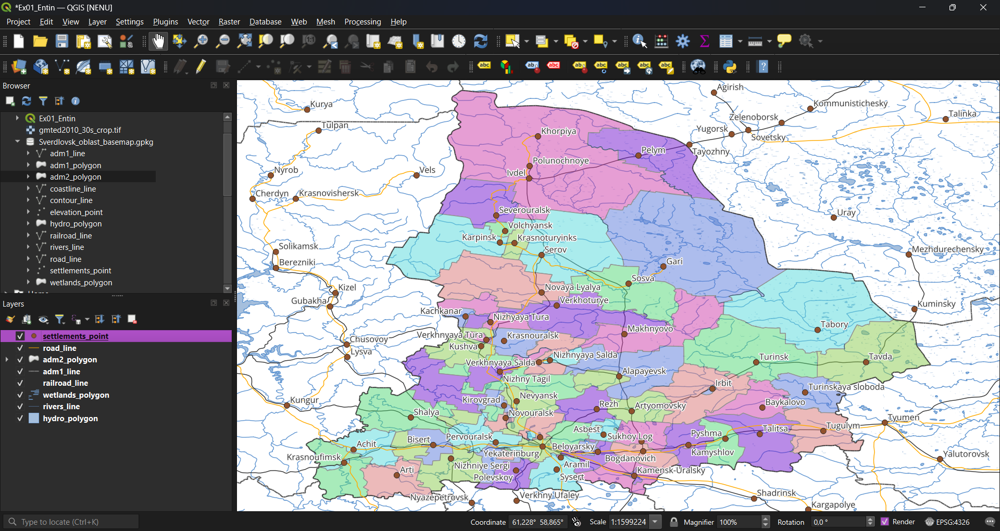

#### Change map projection

To change map projection, press CRS button at the lower-right corner of the screen. Alternatively, go to "Project" — "Properties" — "CRS".

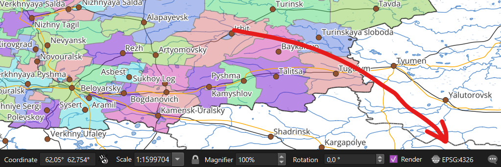

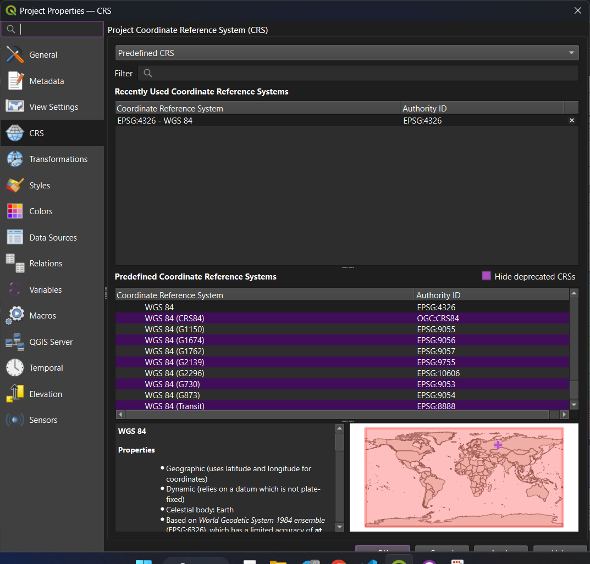

This interface allows you to select any of the pre-defined CRS. You can also define your own CRS.

To define your own CRS, choose "Settings" - "Custom projection..."

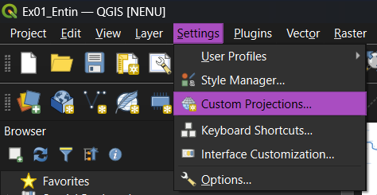

In the "User defined CRS" window, create a new row, enter the name for your CRS and paste the definition in the desired format (WKT or PROJ).

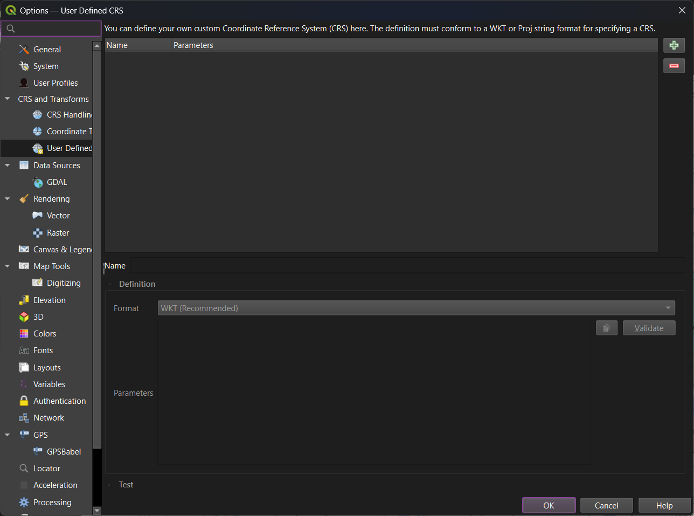

Note that changing project CRS does not affect layers' CRS! QGIS performs 'on-the-fly' transformation when displaying layers in different projections.

Map window with changed projection will look as follows:

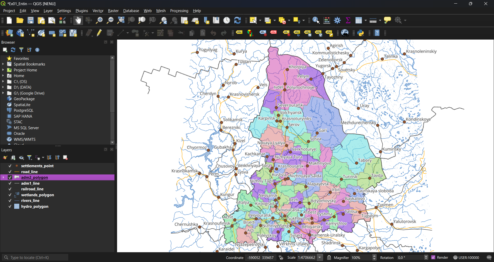

#### Print layouts

QGIS project supports multiple map layouts.

To create a print layout, navigate to "Project" – "New print layout" or press `Ctrl+P`. A small prompt window will appear, enter your layout name here. A new print layout will be opened in a separate window.

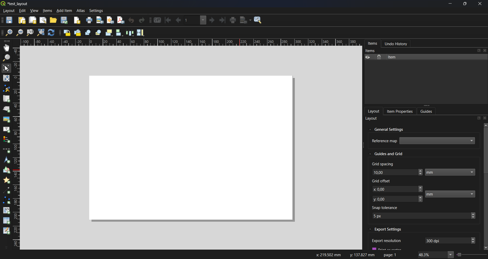

To add new elements on layout, move elements and element contents, use toolbox on the left.

### Related pages from the QGIS user guide

Please note that these materials could be: 1) outdated; 2) sometimes inavailable from Russia.

- [QGIS Graphical user interface](https://docs.qgis.org/3.44/en/docs/user_manual/introduction/qgis_gui.html)
- [User profiles](https://docs.qgis.org/3.44/en/docs/user_manual/introduction/qgis_configuration.html#working-with-user-profiles)
- [Vector symbology properties](https://docs.qgis.org/3.44/en/docs/user_manual/working_with_vector/vector_properties.html#symbology-properties)
- [Raster symbology properties](https://docs.qgis.org/3.44/en/docs/user_manual/working_with_raster/raster_properties.html#symbology-properties)
- [Layout](https://docs.qgis.org/3.44/en/docs/user_manual/print_layout/index.html)

### Related pages from the QGIS training manual

Please note that these materials could be: 1) outdated; 2) sometimes inavailable from Russia.

* [Basic map with vector data](https://docs.qgis.org/3.44/en/docs/training_manual/basic_map/index.html)
* [Vector symbology and labels](https://docs.qgis.org/3.44/en/docs/training_manual/vector_classification/index.html)
* [Raster symbology](https://docs.qgis.org/3.44/en/docs/training_manual/rasters/changing_symbology.html)
* [Layout (map composer)](https://docs.qgis.org/3.44/en/docs/training_manual/map_composer/map_composer.html)