### Objectives

- QGIS interface;
- vector symbology;
- raster symbology;
- map layout.

### Key steps

- Create a GeoPackage file;
- Create a table in a GeoPackage file;
- Create point objects;
- Create polyline objects;
- Create polygon objects;
- Snapping and tracing;
- Advanced editing operations: 
  - rings; 
  - parts; 
  - splitting and merging objects;
  - etc.
- (only if there is time left) Feature annotations.

### Input data for training

A fragment of the Unified Electronic Cartographic Basemap of Russian Federation (rus. Единая электронная картографическая основа, ЕЭКО, officially transliterated as EEKO).

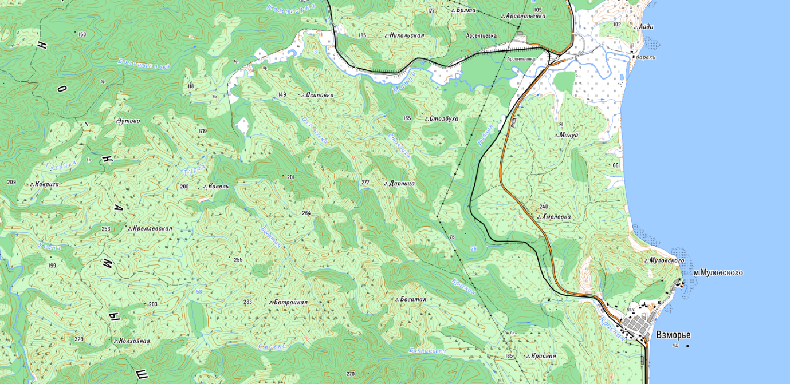

### Screenshots and additional information

#### Create a new GeoPackage

To create a new GeoPackage, toggle *New GeoPackage Layer* button on the Data Source Manager toolbar, or select "Layer" – "Create Layer..." – "New GeoPackage layer", or press `Ctrl+Shift+N`.

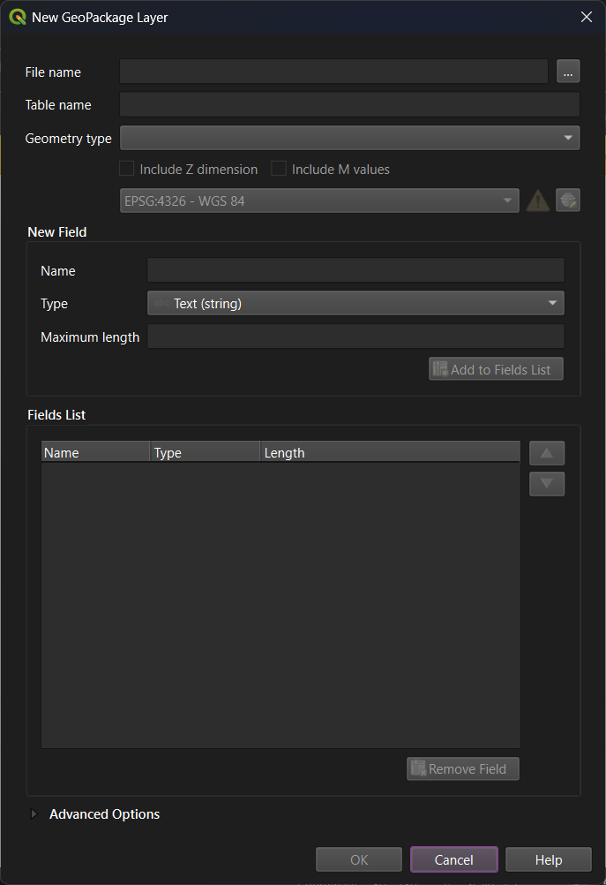

Enter file name, table name, select geometry type and CRS. In the "New field" block, enter a field name and select its type, then press "Add to Fields list". Repeat for other required fields.

#### Create a new table in existing GeoPackage

To add a new table into the existing GeoPackage, find it in the Browser panel, then press right mouse button and select "New Table..."

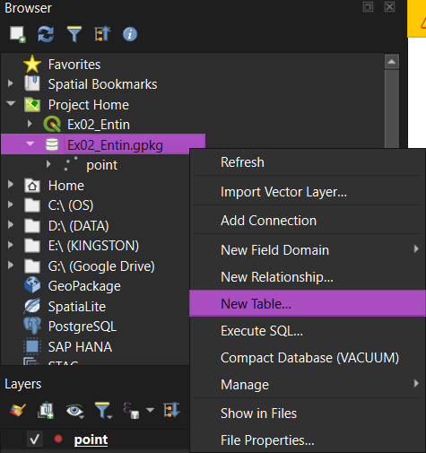

The interface for creating a new table contains the same settings as the interface for creating a new database (GeoPackage), but they are organized in a somewhat different way.

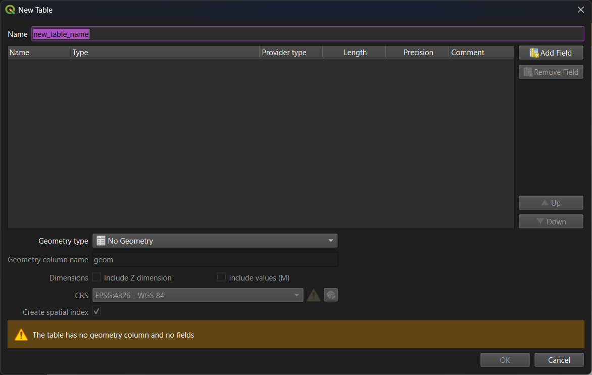

#### Creating and editing data

There are three principal toolbars to create and edit spatial data:

- Digitizing toolbar: 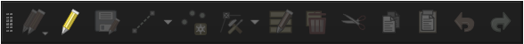
- Advanced digitizing toolbar: 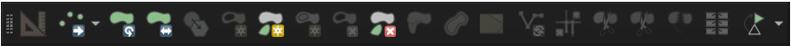
- Snapping toolbar: 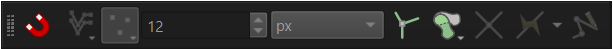

### Topographic map symbols

|Picture|Explanation|
|:-----:|-----------|
|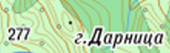|Elevation mark|
||Sea|
|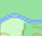  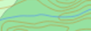|Rivers|
|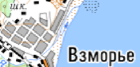|*[grey polygons]* Settlements (each polygon stands for a group of buildings)|
|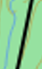|Railroad|
|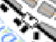|Railway station|
|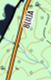 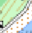 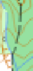|Roads of different classes and their characteristics (*see explanation below*)|
|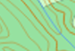|Elevation contours (brown lines) and forest (dark green fill)|
|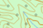|Shrub (light green fill and round-shaped markers)|
|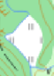|Grass|
|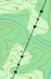|Power lines|

Road characteristics:

- Orange: major roads
- White: other paved roads
- Dashed line: unpaved road
- 8(11)A means:
  -	8: roadway width
  -	11: full road width (roadway with roadsides)
  -	A: material (Asphalt)

### Related pages from the QGIS user guide

Please note that these materials could be: 1) outdated; 2) sometimes inavailable from Russia.

- [Feature Annotations](https://docs.qgis.org/4.2/en/docs/user_manual/map_views/map_view.html#feature-annotations)

### Related pages from the QGIS training manual

Please note that these materials could be: 1) outdated; 2) sometimes inavailable from Russia.

- [Creating a New Vector Dataset](https://docs.qgis.org/4.2/en/docs/training_manual/create_vector_data/create_new_vector.html)
- [Feature Topology](https://docs.qgis.org/4.2/en/docs/training_manual/create_vector_data/topo_editing.html)
